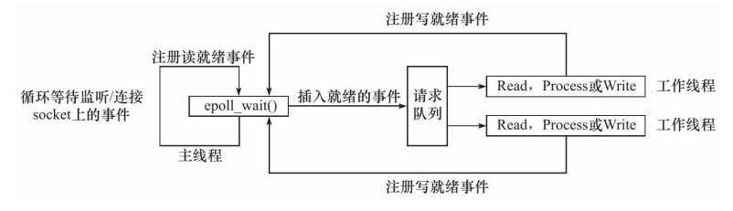
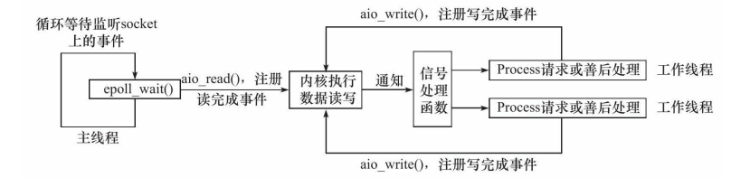
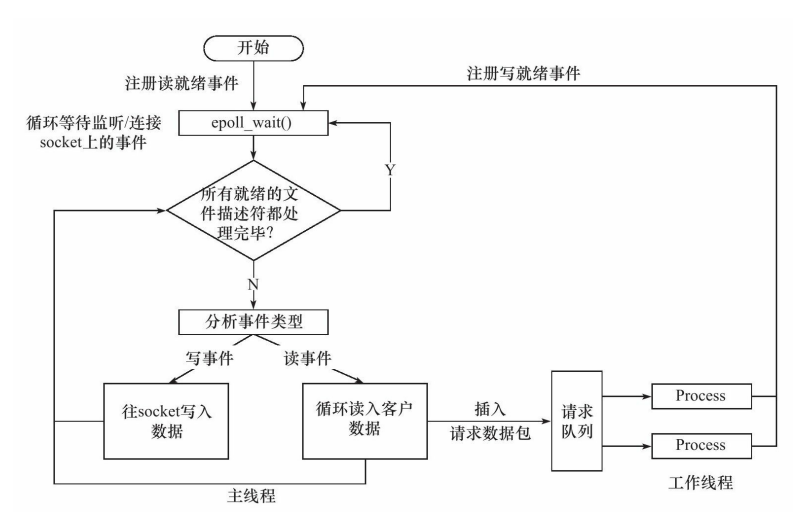
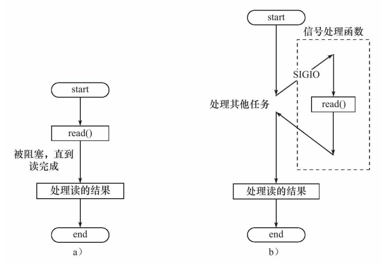

## **服务器框架**

.PNG)

I/O处理单元 ：处理客户的连接，读写网络数据
逻辑单元：业务进程或线程
存储单元：本地数据库，文件缓存
请求队列：各单元之间的通信方式

---
## **I/O方式**

- 阻塞I/O：
  - 在阻塞I/O模型中，应用程序发起一个I/O操作，然后完全挂起，直到数据准备就绪并且复制到应用程序中。在这个过程中，应用程序不做任何工作，只是等待I/O操作完成。
  - 相当于在餐厅点餐，点完餐后，坐在桌子旁等待食物准备好。在这期间，什么也做不了，只能等待。
- 非阻塞I/O：
  - 非阻塞I/O模型允许应用程序在请求I/O操作后继续执行。应用程序需要不断地询问I/O操作是否完成（即轮询），这可能会导致大量的CPU时间浪费在检查操作状态上。
  - 点了餐后不愿意坐着等，而是每隔一分钟去柜台询问食物是否准备好。在等待的时间里，你可以做其他事情。
- I/O复用：
  - I/O复用允许单个进程监视多个I/O流，等待任一流准备好进行读写操作。select和poll是实现I/O复用的常见系统调用。应用程序在一个阻塞调用中等待多个I/O事件中的任何一个发生。
  - 多人在餐厅点了不同的菜。你负责去柜台询问，一旦任何一个菜准备好了，你就会被通知，然后你可以决定接下来的行动。
- SIGIO信号：
  - 信号驱动I/O模型允许应用程序告诉内核，当数据准备好可以进行I/O操作时，通过信号通知应用程序。应用程序不需要不断检查I/O操作是否完成，从而减少了CPU的使用。
  - 你在餐厅点餐后继续做你的事情，但你告诉服务员，一旦我的食物准备好了，就发一个信号给我。收到信号后，你去取餐。
- 异步I/O：
  - 异步I/O模型允许应用程序发起I/O操作后立即返回，继续执行其他任务。内核会在数据准备好并且已经被复制到应用程序指定的内存区域后通知应用程序I/O操作已经完成。这个模型允许应用程序无需等待或者轮询地检查I/O操作，从而实现了真正的并行执行。
  - 在餐厅点餐后，你做你的事情去了。餐厅不仅会准备你的食物，还会主动把食物送到你的桌子上。你不需要去柜台询问，也不需要等待通知。

**非阻塞I/O要配合I/O通知机制使用，如信号、I/O复用**
**同步I/O就是应用程序通知I/O就绪事件**
**异步I/O就是应用程序通知I/O完成事件**
[异步I/O形象解释](https://www.liaoxuefeng.com/wiki/1016959663602400/1017959540289152)

----
## 事件处理模式

**Reactor模式**

主线程只负责监听文件描述符是否有事件发生，有就通知逻辑单元(工作线程)执行。一般使用同步I/O模型

相当于在一个餐厅中，服务员(主线程)等待客户点餐，然后将客户的点餐记录在菜表上(事件队列)，然后通知厨师(工作线程)做菜。服务员继续等待其他客户点餐。当厨师做好菜，会告诉服务员，服务员再将菜品送到对应的顾客手中。



**proactor模式**

Proactor模式将所有I/O操作都交给主线程和内核来处理，工作线程仅仅负责业务逻辑。一般使用异步I/O模型

相当于服务员这次只负责客户的点餐的操作，一旦有客户点餐就立即通知给厨师开始做菜，当厨师做完之后，厨师自己再给客户去送餐



**模拟Proactor模式**

利用同步I/O模拟出异步I/O



## 并发模式

*在I/O模型中，“同步”和“异步”区分的是内核向应用程序通知的是何种I/O事件（是就绪事件还是完成事件），以及该由谁来完成I/O读写（是应用程序还是内核）*。在并发模式中，“同步”指的是程序完全按照代码序列的顺序执行；“异步”指的是程序的执行需要由系统事件来驱动。



**半同步半异步模型**

半同步/半异步模式中，同步线程用于处理客户逻辑中的逻辑单元；异步线程用于处理I/O事件异步线程监听到客户请求后，就将其封装成请求对象并插入请求队列中。请求队列将通知某个工作在同步模式的工作线程来读取并处理该请求对象。具体选择哪个工作线程来为新的客户请求服务，则取决于请求队列的设计。

**半同步反应堆**
半同步/半反应堆并发模式是半同步/半异步的变体，将半异步具体化为某种事件处理模式.

半同步/半异步模式工作流程
>同步线程用于处理客户逻辑
>异步线程用于处理I/O事件
>异步线程监听到客户请求后，就将其封装成请求对象并插入请求队列中
>请求队列将通知某个工作在**同步模式的工作线程**来读取并处理该请求对象

半同步/半反应堆工作流程（以Proactor模式为例）
>主线程充当异步线程，负责监听所有socket上的事件
>若有新请求到来，主线程接收之以得到新的连接socket，然后往epoll内核事件表中注册该socket上的读写事
>如果连接socket上有读写事件发生，主线程从socket上接收数据，并将数据封装成请求对象插入到请求队列中
>所有工作线程睡眠在请求队列上，当有任务到来时，通过竞争（如互斥锁）获得任务的接管权

## 线程池
[实现地址](http://chenfeifei.online/2023/08/11/c-11-xian-cheng-chi/)

## I/O多路复用技术

名词解释：
>文件描述符:相当于一个文件、设备等的标识，就好比排队取餐给你一个餐号，取到根据餐号就能判断是不是你的餐食，文件描述符就相当于餐号。

>I/O复用:程序可以同时监控多个文件描述符,在传统的阻塞IO模型中，每个IO操作都需要一个独立的线程来处理，当有大量的IO操作时，会导致线程数量的增加，从而带来线程切换和上下文切换的开销。而多路复用通过使用一个线程来监听多个IO事件，避免了线程数量的增加，减少了线程切换和上下文切换的开销。

>IO事件就绪通知：多路复用机制通过操作系统提供的系统调用（如select、poll、epoll等）来监听多个IO事件的就绪状态。当有任何一个IO事件就绪时，操作系统会通知应用程序，告知哪些IO事件已经准备好可以进行读取或写入操作。

>非阻塞IO：多路复用机制通常与非阻塞IO配合使用。在非阻塞IO模型中，当一个IO操作无法立即完成时，不会阻塞线程，而是立即返回一个错误码或特定的状态，应用程序可以继续处理其他IO操作或其他任务，提高了系统的并发性能。

>事件循环：多路复用机制通过事件循环来处理就绪的IO事件。事件循环会不断地监听IO事件的就绪状态，当有IO事件就绪时，会调用相应的回调函数来处理该事件。通过事件循环的方式，可以高效地处理多个IO操作。

**三种复用方式**
|select|poll|epoll|
|--|--|--|
|将想要监控的文件描述符给它并复制到内核中,所以会限制大小,同时当select返回后我们仅仅能知道有些文件描述符可以读写了，但是我们不知道是哪一个,需要进程再次遍历找到|解决了select限制大小的问题|引入epoll_ctl很体贴的做到了只操作那些有变化的文件描述符，而不是全部拷贝,并且与内核共享内存,记录改变的文件描述符通知进程，不需要进程自己寻找|

**两种触发方式**
边缘触发(ET)：当被监控的 Socket 描述符上有可读事件发生时，服务器端只会从 epoll_wait 中苏醒一次
水平触发(LT)：当被监控的 Socket 上有可读事件发生时，服务器端不断地从 epoll_wait 中苏醒，直到内核缓冲区数据被 read 函数读完才结束
ET:快递站只发一次消息让你取快递，无论你取不取
LT:快递站点只要你不取快递就一直通知你，直到取为止
*边缘触发模式一般和非阻塞 I/O 搭配使用*，select/poll 只有水平触发模式，epoll 默认的触发模式是水平触发，但可以设置为边缘触发
一般情况下 边缘触发>水平触发(不断系统调用，增加上下文切换开销)

epollAPI：

- epoll_create
  - int epoll_create(int size)
  - 创建一个指示epoll内核事件表的文件描述符，改描述符将作为其他epoll系统调的第一个参数
- epoll_ctl
  - 用于操作内核事件表监控的文件描述符上的事件：注册、修改、删除
  - 参数
    - int epoll_ctl(int epfd, int op, int fd, struct epoll_event *event)
    - epfd：为epoll_creat的句柄
    - op：表示动作，用3个宏来表示：
      - EPOLL_CTL_ADD (注册新的fd到epfd)，
      - EPOLL_CTL_MOD (修改已经注册的fd的监听事件)，
      - EPOLL_CTL_DEL (从epfd删除一个fd)；
    - event：告诉内核需要监听的事件
      event是epoll_event结构体指针类型，表示内核所监听的事件
      ```c++
        struct epoll_event {
          _uint32_t events; /* Epoll events */
          epoll_data_t data; /* User data variable */
        };
      ```
- epoll_wait
  - int epoll_wait(int epfd, struct epoll_event *events, int maxevents, int timeout)
  - 用于等待所监控文件描述符上有事件的产生，返回就绪的文件描述符个数
  - 参数
    - events：用来存内核得到事件的集合，
    - maxevents：告之内核这个events有多大，这个maxevents的值不能大于创建epoll_create()时的size，
    - timeout：是超时时间
      - -1：阻塞
      - 0：立即返回，非阻塞
      - \>0：指定毫秒
  - 返回值：成功返回有多少文件描述符就绪，时间到时返回0，出错返回-1
----
reference:
[epollAPI](https://mp.weixin.qq.com/s/BfnNl-3jc_x5WPrWEJGdzQ)
[多路复用](https://blog.csdn.net/m0_60259116/article/details/137118746)
[触发方式](https://xiaolincoding.com/os/8_network_system/selete_poll_epoll.html#epoll)
